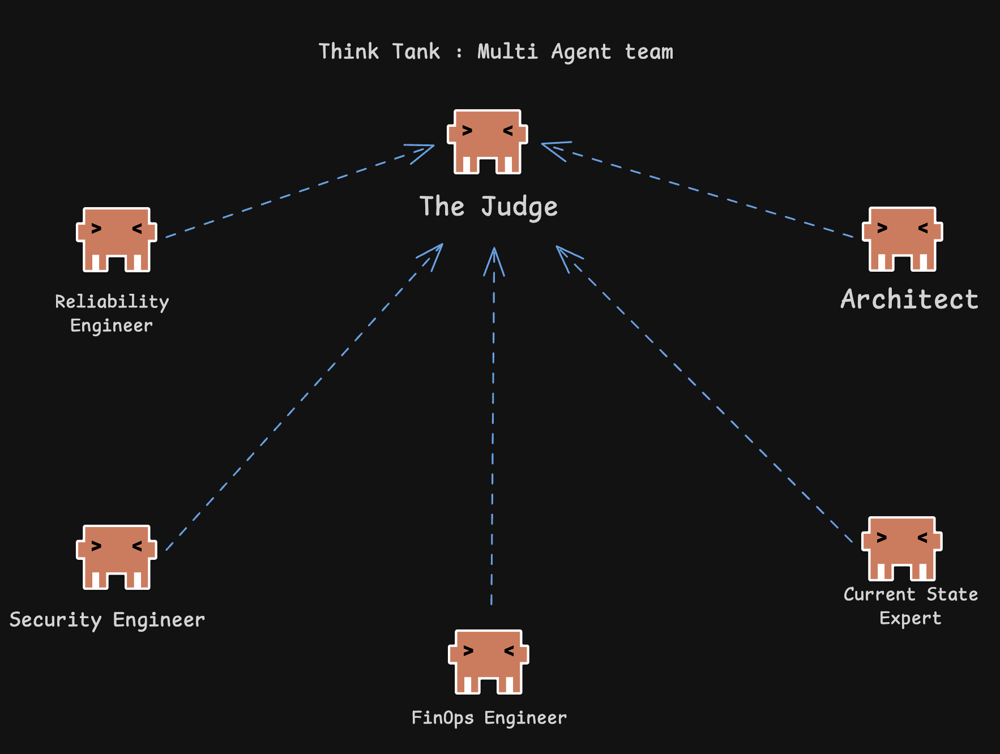
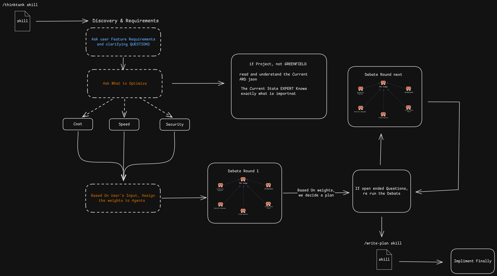

# ThinkTank: Architecture & Execution Orchestrator

ThinkTank is an advanced, multi-agent orchestration skill designed for Claude Code. It addresses a critical gap in single-agent LLM workflows: the lack of adversarial peer review and architectural persistence.

Instead of just outputting code, ThinkTank forces a structured, token-optimized debate across multiple technical domains (security, cost, maintainability) before any system design is finalized. Accepted designs are compiled into structured JSON Architecture Decision Records (ADRs), creating a persistent memory layer that future agents are forced to respect.

## The Problem We Are Solving

When developers use single-agent LLMs (like standard Claude Code or Copilot), the AI typically generates the *first* solution it thinks of, which is often a generic, happy-path implementation. Single agents lack the adversarial friction required to build enterprise-grade systems. They don't push back on bad ideas, they don't consider cloud hosting costs, and they rarely check for obscure security vectors.

**ThinkTank solves this by introducing multi-agent adversarial friction.** Before a single line of code is written, your idea must survive a gauntlet of specialized expert personas who debate the trade-offs of your architecture.

## The Agent Teams (Personas)

ThinkTank comes pre-configured with a specialized engineering committee:



-  **System Architect:** Proposes the initial design, pushing for elegant, highly-scalable component structures.
- **Security Engineer:** Actively attacks the Architect's proposal, looking for lateral movement vectors, IAM leaks, and zero-trust violations.
- **FinOps Engineer:** Calculates the theoretical AWS/Cloud cost of the proposal and forces the team to reconsider expensive choices (e.g., NAT Gateways vs. VPC Endpoints).
- **Reliability Engineer:** Flags single points of failure and pushes back against complex single-table database designs that harm Developer Experience.
- **Current State Expert:** Acts as the historian. They enforce past Architectural Decisions (ADRs) to ensure the new feature doesn't conflict with existing codebase patterns.
- **Engineering Manager (The Judge):** Evaluates the debate, penalizes over-engineering, resolves stalemates, and enforces pragmatism.

## The 5-Stage Engine

Because ThinkTank operates as a strict state machine, it will never blindly generate code on the first prompt. It guides you through a mandatory 5-stage deployment engine to ensure your architecture is bulletproof.



### 1. Discovery & Requirements
When triggered, ThinkTank stops and asks 2-3 precise, clarifying questions. It forces you to define exactly what feature you want to build and what your primary optimization focus is (e.g., prioritizing low AWS costs vs. prioritizing high availability).

### 2. Context Analysis
ThinkTank silently analyzes your workspace. If you are working in a greenfield project, it proceeds. If it detects a brownfield (legacy) repository, it halts to ask if there are any existing architectural constraints or legacy decisions that need to be documented before it designs the new feature. This prevents the AI from suggesting modern patterns that break your legacy code.

### 3. The Smart Debate
This is the core of ThinkTank. Your idea is routed to the specialized experts. 
- **Targeted Debate:** If you specify a focus (e.g., "[Focus: Security]"), a highly-efficient 3-node debate runs.
- **Full Debate:** Otherwise, all 5 experts debate the trade-offs of the system design. The Engineering Manager actively penalizes any persona pushing for "over-engineering" to ensure the final architecture remains pragmatic.

### 4. Final Decision & Guardrails
Once the debate concludes, the Engineering Manager declares the final approach. It explicitly states what the architecture is optimized for (e.g., "Optimized for Cost and Maintainability"). It generates a preview of the architectural guardrails in plain English and explicitly asks for your approval before writing anything to disk.

### 5. Execution & ADR Persistence
Upon your approval, ThinkTank silently locks the design by writing a persistent JSON Architecture Decision Record (ADR) into your `.arch-decisions/` folder. It then seamlessly hands off execution by either directly implementing the feature via your file tools, or triggering the `/write-plan` skill to generate a step-by-step implementation plan, concluding with exact testing steps.

## Usage

You can seamlessly import the Zero-Dependency ThinkTank skill directly into your local Claude Code environment.

### 1. Installation
Locate the `thinktank.skill` file in this repository and run the following command in your terminal:
```bash
claude skill add thinktank.skill
```

### 2. Triggering the Workflow
To initiate the full architectural engine, use the `ThinkTank:` prefix:
```text
ThinkTank: I want to build a real-time notification system.
```

### 3. Token Optimization (Targeted Debates)
To minimize token consumption, you can enforce a Targeted Debate. By specifying a primary focus, the skill dynamically drops irrelevant personas and runs a highly-efficient, 3-node debate (Architect vs. Specialist vs. Manager).
```text
ThinkTank: I want to build a webhook handler [Focus: Security]
```

## Architecture Decision Records (ADRs) in Reality

One of the core features of ThinkTank is **Architectural Persistence**. Without persistence, an AI will forget why a certain design pattern was chosen, leading to conflicting code implementations in the future.

When you approve an architectural approach, ThinkTank generates an ADR and stores it in your repository under `.arch-decisions/`. 

**What does this look like in reality?**
- It's a lightweight, machine-readable JSON file.
- It records the **Context** (why the decision was made), the **Decision** (what we are building), and the **Guardrails** (strict rules for implementation).
- Future agents running in your codebase will silently ingest these ADRs and *refuse* to write code that violates your established guardrails.

## Upcoming: Web Visualization Platform
A companion web platform to visually monitor the real-time multi-agent debate and interface directly with your GitHub repositories is currently in development and **coming soon here**.
